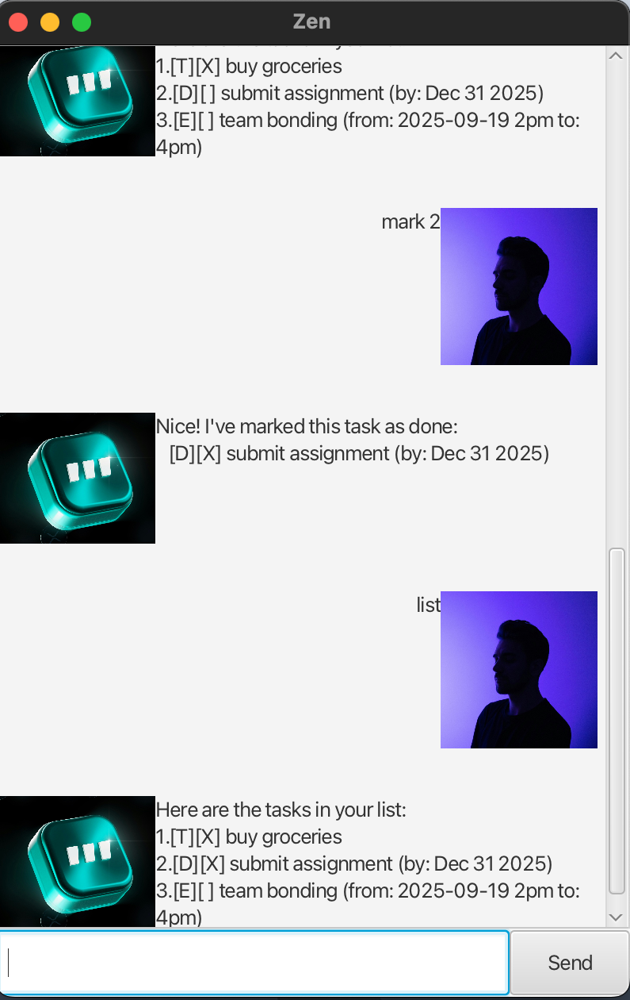

# Zen User Guide

Zen is a friendly task management chatbot that helps you organize your daily tasks, deadlines, and events.



With Zen, you can:

- Create different types of tasks (todos, deadlines, events)
- Mark tasks as completed or incomplete
- List your tasks
- Get help with commands anytime
- Enjoy a clean GUI interface

## Getting Started

To start using Zen, simply run the application and you'll be greeted with a friendly welcome message. You can then start typing commands to manage your tasks.

## Basic Commands

### Viewing Help

Get a list of all available commands and their usage:

```bash
help
```

Expected output:

```bash
Here are the commands you can use:

bye                              - Exit the application
list                             - Show all tasks
help                             - Show this help message

todo <description>               - Add a todo task
deadline <description> /by <date> - Add a deadline task
event <description> /from <start> /to <end> - Add an event task

mark <number>                    - Mark a task as done
unmark <number>                  - Mark a task as not done
delete <number>                  - Delete a task

find <keyword>                   - Find tasks containing keyword
```

### Viewing All Tasks

Display all your current tasks:

```bash
list
```

Expected output:

```bash
Here are the tasks in your list:
1. [T][ ] Buy groceries
2. [D][X] Submit report (by: Dec 25 2024)
3. [E][ ] Team meeting (from: Dec 20 2024, 2:00 PM to: 4:00 PM)
```

### Exiting the Application

To close Zen:

```bash
bye
```

Expected output:

```bash
Bye. Hope to see you again soon!
```

## Task Management

### Adding Tasks

#### Adding Todo Tasks

Create a simple todo task without any specific deadline:

```bash
todo Buy groceries
```

Expected output:

```bash
Got it. I've added this task:
  [T][ ] Buy groceries
Now you have 1 tasks in the list.
```

#### Adding Deadline Tasks

Create a task with a specific deadline:

```bash
deadline Submit report /by 2024-12-25
```

Expected output:

```bash
Got it. I've added this task:
  [D][ ] Submit report (by: Dec 25 2024)
Now you have 2 tasks in the list.
```

#### Adding Event Tasks

Create an event with start and end times:

```bash
event Team meeting /from 2024-12-20 2pm /to 4pm
```

Expected output:

```bash
Got it. I've added this task:
  [E][ ] Team meeting (from: 2024-12-20 2pm to: 4pm)
Now you have 3 tasks in the list.
```

### Managing Task Status

#### Marking Tasks as Done

Mark a task as completed using its number from the list:

```bash
mark 1
```

Expected output:

```bash
Nice! I've marked this task as done:
  [T][X] Buy groceries
```

#### Marking Tasks as Not Done

Unmark a completed task:

```bash
unmark 1
```

Expected output:

```bash
OK, I've marked this task as not done yet:
  [T][ ] Buy groceries
```

#### Deleting Tasks

Remove a task from your list:

```bash
delete 2
```

Expected output:

```bash
Noted. I've removed this task:
  [D][ ] Submit report (by: Dec 25 2024)
Now you have 2 tasks in the list.
```

## Finding Tasks

Search for tasks containing specific keywords:

```bash
find meeting
```

Expected output:

```bash
Here are the matching tasks in your list:
1. [E][ ] Team meeting (from: 2024-12-20 2pm to: 4pm)
```

## Date and Time Formats

Zen supports flexible date and time formats for deadlines and events:

### Supported Formats:

- **ISO Date**: `2024-12-25` (displays as "Dec 25 2024")
- **ISO DateTime**: `2024-12-20T14:00` (displays as "2024-12-20 2pm")

### Examples:

- `deadline Submit assignment /by 2024-12-31`
- `event Lunch /from 12pm /to 1pm`
- `event Conference /from 2024-12-20T09:00 /to 2024-12-20T17:00`

## Task Format Legend

Tasks are displayed with the following format:

- `[T]` = Todo task
- `[D]` = Deadline task
- `[E]` = Event task
- `[X]` = Task is completed
- `[ ]` = Task is not completed

## Tips and Tricks

- Use `Ctrl+L` to clear the chat history in GUI mode
- You can use partial keywords when searching (e.g., "meet" will find "meeting")
- Date formats are flexible - use what's most natural for you
- The application automatically saves your tasks, so you won't lose them when you close and reopen Zen

## Troubleshooting

If you encounter any issues:

- Make sure to include descriptions for all tasks
- For deadline tasks, don't forget the `/by` keyword
- For event tasks, make sure to include both `/from` and `/to`
- Task numbers should be valid (within the range of your current tasks)
- Use the `help` command anytime to see available commands
